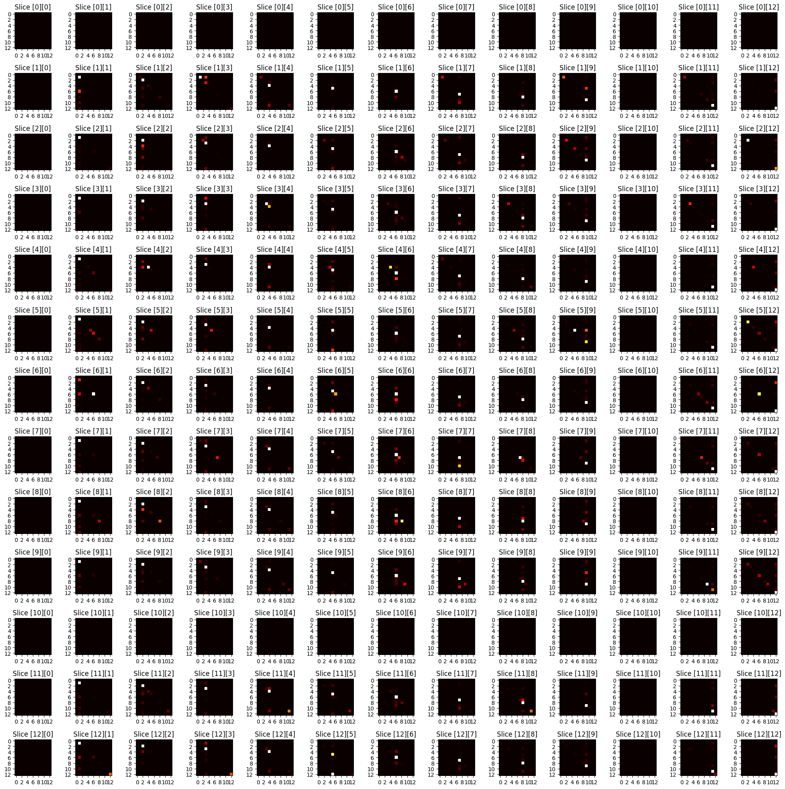

This repo contains my effort to adapt EEG signals to temporal graphs with semantics.
The citation for the original NN is in the subfolder.

**Successful Instances of Aggregation from Sampler**

**From Aggregation of Successful Paths to Generate One Hop Sequence for good representation of Node 10** These are currently cherry-picked from high scoring samples for demostration purpose, longer sequence generation from model is WIP, refer to `find_universal_path_from_subspace` for how to use a symmetric, proximity matrix(created from annotation in  to compute universal path)

